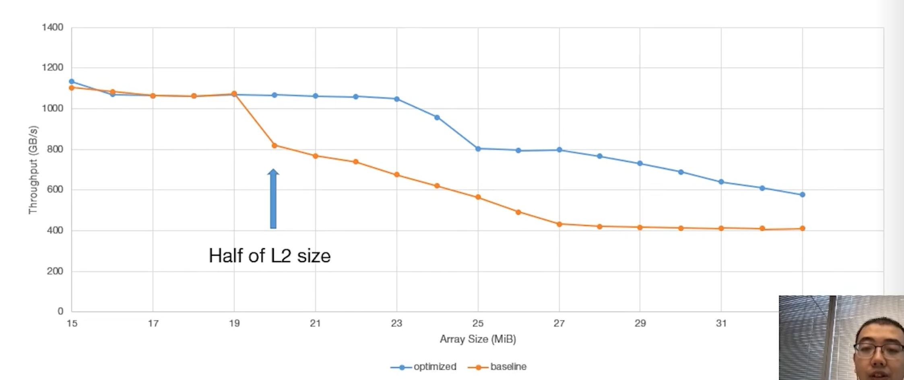
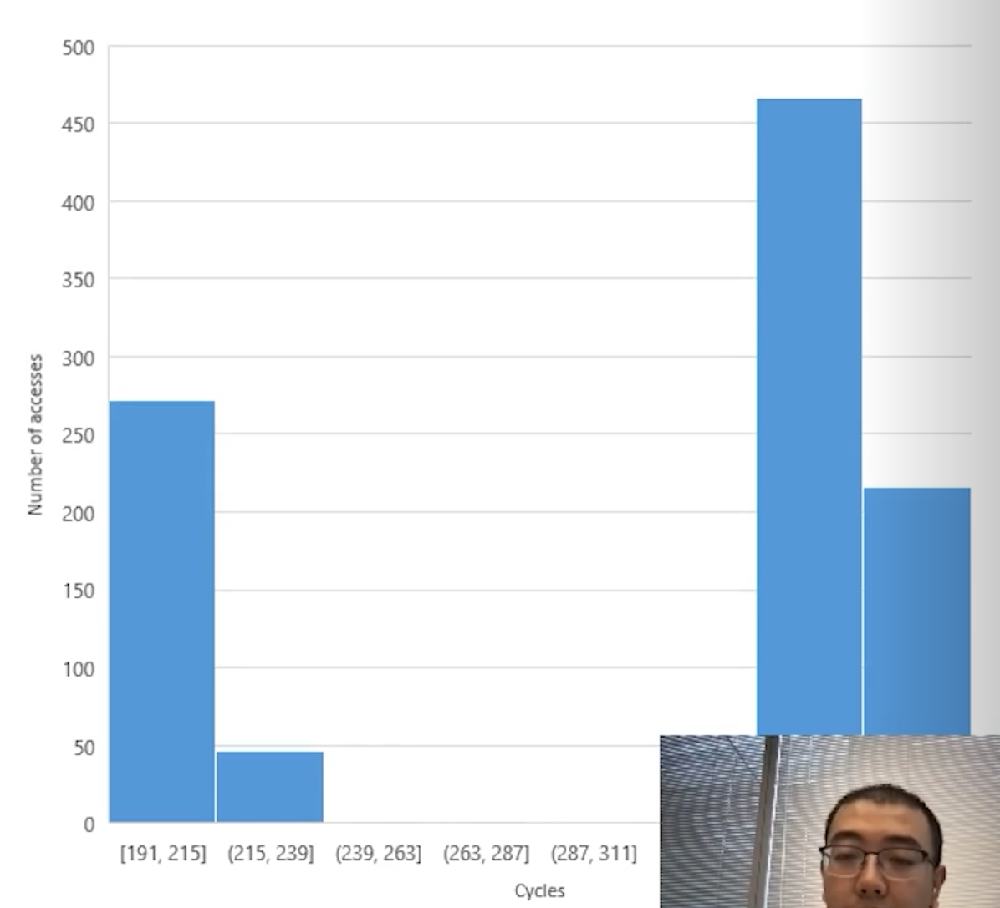
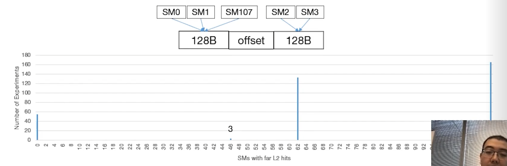
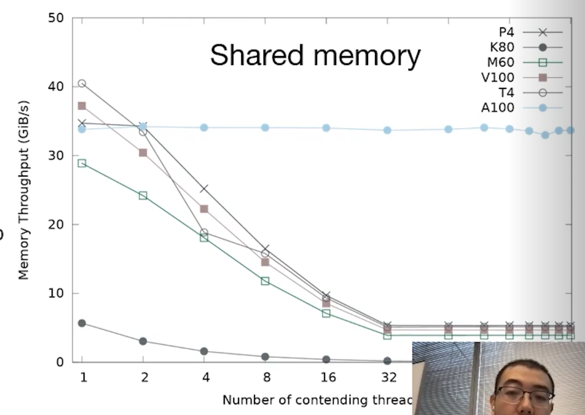
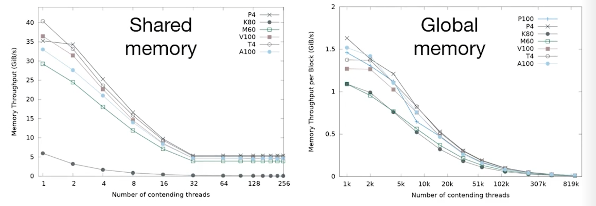
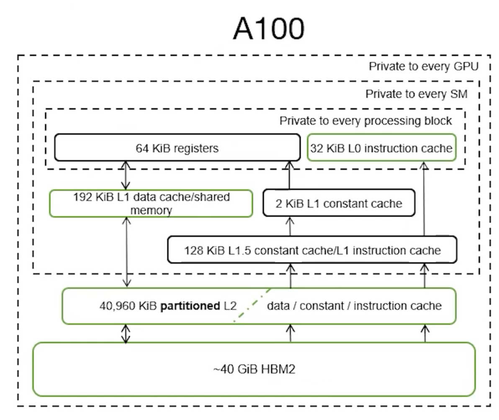
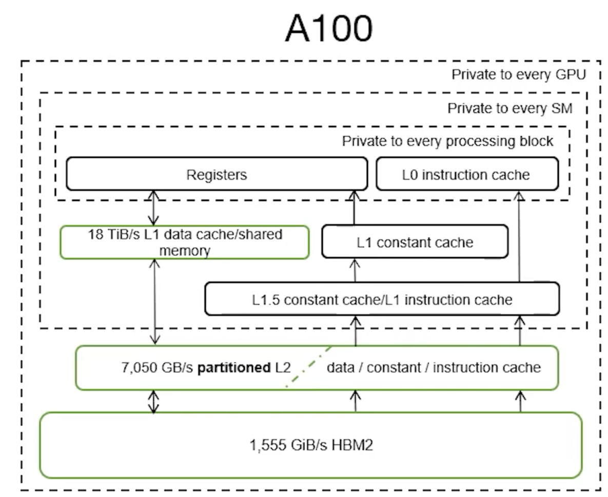

My notes on GTC 2021 talk: [Dissecting the Ampere GPU Architecture through Microbenchmarking](https://www.nvidia.com/en-us/on-demand/session/gtcspring21-s33322/). The research uses microbenchmarking to reveal internal details about Ampere's L2 cache design, atomic operations, fine-grained sparsity and memory improvements over the V100.

<!-- truncate -->

## Grouping Work by L2 Partition

Ampere features a split L2 design. Relative to each Streaming Multiprocessor (SM), the L2 cache is divided into a "near" partition and a "far" partition. Each partition holds 20 MB of space, totaling 40 MB across the GPU.

The hardware resolves cache line requests using the following hierarchy:

1. **Check the L1 cache.** If there is a miss, proceed to the L2 cache.
2. **Check the near L2 partition.** If there is a miss, query the far L2 partition.
3. **Check the far L2 partition.** If the data is found here, the cache line is moved/copied to the near partition. If it is a miss, the request goes to global memory.
4. **Query global memory.** Each memory address corresponds to one specific L2 partition. Note that when data is fetched from global memory, it goes to its assigned partition. The cache line does not automatically migrate to the near partition of the SM that requested it. This behavior will be demonstrated in later experiments.

Failing to group work effectively introduces two major hazards:

- **Latency:** There is a 1.75x slowdown when an SM has to access data from the far partition.

- **Cache Thrashing/Duplication:** If data is constantly moved from the far partition to the near partition, the same cache line ends up duplicated, consuming valuable space in multiple partitions.

Developers usually want SMs to populate the cache cooperatively instead of thrashing the cache. Cache capacity can be doubled when access are managed well.

### Case study: pairs of partition-aware blocks

The presentation author conducted an experiment by iterating through large chunks of global memory data and performing simple computations. They assigned a pair of thread blocks to operate on a chunk of data, ensuring the dataset size exceeded the L1 cache capacity to force L2 cache accesses. Two pairing combinations were tested:

- One block on the near partition and one block on the far partition.
- Both blocks on the near partition.

The results demonstrated that co-locating both blocks on the near partition yielded an 85% increase in throughput due to more efficient utilization of the L2 cache. The figure below shows that when the requested data size exceeds 20 MB (the capacity of a single L2 partition), relying on the far partition causes a significant drop in throughput.

### Hit latency (Access Cycles)

This experiment demonstrates the Non-Uniform Cache Access (NUCA) architecture of NVIDIA Ampere GPUs. The test involved a single thread within a block scanning a large global array twice, deliberately bypassing the L1 cache.

- The **first scan** loaded the data from global memory into the L2 cache partition that corresponds to the physical address.

- The **second scan** measured the actual L2 cache hit latency.

The results revealed a clear bimodal distribution, with access times grouping around either 200 cycles or 350 cycles. 

This dual-peak pattern confirms that the L2 cache is physically partitioned across the massive GPU die. Data located in the near partition is retrieved faster than data residing in the far partition across the chip.

### Latency distribution over all SMs

#### The Setup: Two Groups, Two Segments

The author notes there are 108 SMs in total on the chip. They split these into two groups based on assumed physical location:

- **Group 0:** SMs assumed to be physically near Partition 0. Let's say there are **X** SMs in this group.
- **Group 1:** SMs assumed to be physically near Partition 1. Let's say there are **Y** SMs in this group.
- We know that **X + Y = 108**.

The experiment dictates that Group 0 *only* reads "Memory Segment A" and Group 1 *only* reads "Memory Segment B".

#### The Variable: Tricking the Hardware Hash

By constantly changing the `offset` (the empty space between Segment A and Segment B), the author forces the GPU's hardware memory controller to **randomly map those two segments** into the two L2 cache partitions.

Because there are two memory segments and two cache partitions, there are only **four possible ways** the hardware can map them during any given run.

#### The Four Permutations (The Deduction)

By running the experiment many times with different offsets, the author captures all four possible mapping scenarios. Let's look at the expected "Far L2 Hits" for each:

- Scenario 1: Perfect Match (0 Far Hits)
  - Segment A maps to Partition 0. Segment B maps to Partition 1.
  - Group 0 reads from its near partition. Group 1 reads from its near partition.
  - **Result:** 0 SMs experience far hits. This matches the spike at **0** on the graph.
- Scenario 2: Total Mismatch (108 Far Hits)
  - Segment A maps to Partition 1. Segment B maps to Partition 0.
  - Group 0 has to cross the chip. Group 1 has to cross the chip.
  - **Result:** All 108 SMs experience far hits. This matches the spike at **108** on the graph (mentioned in text).
- Scenario 3: Both Segments in Partition 0 (Y Far Hits)
  - Segment A maps to Partition 0. Segment B maps to Partition 0.
  - Group 0 gets a near hit (0 far hits). Group 1 has to cross the chip to get its data.
  - **Result:** Only the SMs in Group 1 experience far hits. Therefore, the number of far hits equals **Y**.
- **Scenario 4: Both Segments in Partition 1 (X Far Hits)**
  - Segment A maps to Partition 1. Segment B maps to Partition 1.
  - Group 0 has to cross the chip to get its data. Group 1 gets a near hit (0 far hits).
  - **Result:** Only the SMs in Group 0 experience far hits. Therefore, the number of far hits equals **X**.

#### The Conclusion

Looking at the graph, the only two numbers that appear between 0 and 108 are **46** and **62**.

Because Scenario 3 and Scenario 4 uniquely isolate the exact number of SMs in Group 1 (Y) and Group 0 (X), the author can definitively conclude that the two groups consist of 46 SMs and 62 SMs.

Furthermore, checking the math confirms the deduction: **46 + 62 = 108**. This perfectly accounts for all SMs on the chip, proving the asymmetrical physical design of the Ampere GPU where one cache partition serves 62 SMs and the other serves 46.

### Global address space evenly distributed across L2 partitions

Finally, the author compared the access times of different global memory addresses at a finer granularity. They discovered that virtual addresses are mapped to L2 partitions in **8-KB chunks** iteratively . Furthermore, sub-slices of the L2 cache are directly associated with specific HBM memory controllers, corroborating the architectural descriptions provided in NVIDIA's official whitepaper.

## Atomics

### Shared memory atomics: a new, contention-free increment 

Ampere introduces a powerful new atomic increment instruction: `ATOMS.POPC.INC`. Traditionally, atomic instructions can bottleneck execution; when multiple threads attempt to operate on a single memory address simultaneously, hardware contention occurs. This leads to thread stalls and a significant drop in throughput.

The author conducted experiments on multiple generations of GPU. They reveal that only Ampere's atomic increment does not suffer from throughput drop. However, it is important to note that adding values other than 1 still relies on the legacy `ATOMS.ADD` operation. Contention penalties still exist.

#### Experiment Setup

To test this, the author designed a benchmark: N threads within a 256-thread block atomically increment a shared memory location by an immediate value of 1. 

- The value of N was varied from 1 to 256, 
- and every N threads assigned to sequential memory addresses.

#### All other atomics still suffer from contention

The author also designed experiments for other atomic operations. 

When benchmarking other atomics, throughput consistently drops due to contention across both shared and global memory. Comparing Ampere's performance to older architectures reveals the following:

- **Shared Memory:** Ampere performs slightly worse than the V100.
- **Global Memory:** Ampere performs slightly better than the V100.
- **P4 and T4 GPUs:** Interestingly, these older architectures yield the best throughput in these specific scenarios, primarily due to their higher base clock frequencies.

## Sparse Matrix Multiplication

For a deep dive into Ampere's Sparse Matrix Multiplication capabilities, please refer to the official NVIDIA architecture whitepapers.

## A100 vs V100

When comparing the A100 directly to its predecessor, the V100, several core architectural elements remain unchanged, while memory and caching have seen massive overhauls.

#### Key Similarities to V100

- Instruction encoding
- Dual-port registers
- Shared memory latency behavior (specifically regarding bank conflicts)
- Overall memory topology

#### Key Differences from V100

- Bank conflicts on the A100 result in **higher latency penalties** than on the V100.

### Memory Capacity

The A100 features significantly expanded memory structures across the board:

- **L0 Instruction Cache:** 2.7x larger (verified via micro-benchmarking).
- **L1 & Shared Memory:** Total combined capacity is 1.5x larger.
  - Achieves 96% utilization of the theoretical L1 maximum.
  - Allows 100% utilization of shared memory (with only 1 KiB reserved).
- **Unified L2 Cache:** More than 6x larger overall, with each individual partition growing by more than 3x.
- **Global Memory:** 2.5x larger capacity.

### Memory Bandwidth

Bandwidth has been scaled up significantly to feed the larger caches and higher SM count:

- **Global Memory Bandwidth:** 1.7x faster
  - More than 1.4x increase in memory clock speed
- **L2 Memory Bandwidth:** 2.6x faster
  - More than 3% increase in graphics clock
- **Shared memory bandwidth**: 1.4x faster
  - Same as L1 which is co-located
  - Proportional to increase in SM count from 80 to 108 and the increase in graphics clock
- Observed-theoretical ratio is over V100
  - Global memory and L1 with 92% theoretical maximum
